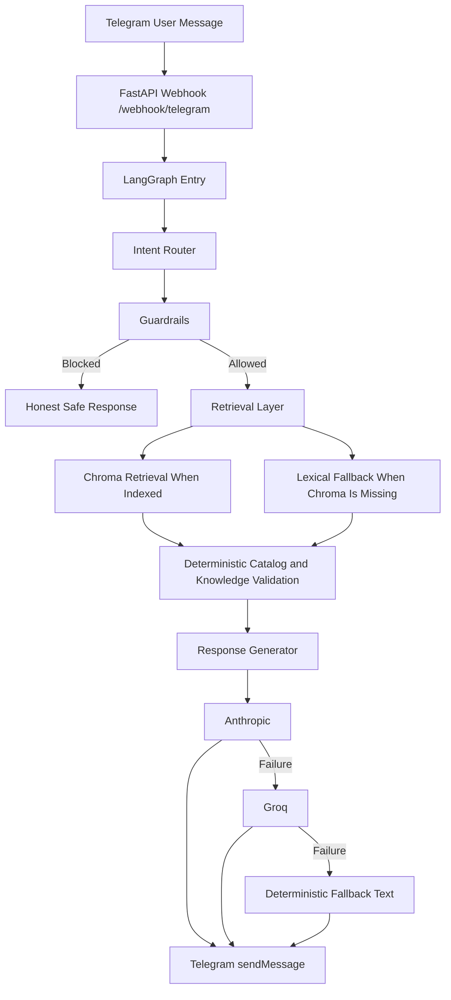

# Intelligent Ecom Agent

Telegram sales assistant for a fashion e-commerce store, built to demonstrate production-minded AI engineering with FastAPI, LangGraph, deterministic guardrails, and optional Chroma-backed RAG.

## What This Project Proves

This project is intentionally not just a chatbot demo.

It is designed to show:

- agent orchestration with `LangGraph`
- separation between LLM-generated language and source-of-truth business data
- deterministic business guardrails
- real Telegram webhook integration
- regression tests that protect critical store behavior

## Problem Statement

Most retail chatbots fail in the same place: they sound fluent, but they invent prices, sizes, stock, and policies.

This project is built around the opposite approach:

- the LLM is used for language generation
- catalog and inventory facts come from verified local data
- policy answers come from verified knowledge sources
- unsafe or irrelevant requests are blocked before generation

That design is the core business value of the system.

## Architecture

### Main components

- `FastAPI` receives Telegram webhook events
- `LangGraph` orchestrates the intent, retrieval, guardrails, response, and fallback flow
- `JSON catalog` acts as the deterministic product source of truth
- `Markdown knowledge base` stores policies, FAQ, and size guidance
- `Chroma` can back semantic retrieval through local persistence
- `Anthropic` is the primary text generation provider
- `Groq` is the fallback generation provider
- `OpenAI Embeddings` is used only for vector indexing and similarity search

### Flow Diagram



## Why These Decisions Were Made

### 1. LangGraph instead of a single prompt chain

- Decision: model the assistant as explicit nodes for intent, retrieval, guardrails, response, and fallback
- Why: the project goal is not just text generation; it is controllable agent behavior with inspectable transitions
- Business impact: easier debugging, safer extensions, clearer interview story

### 2. Deterministic catalog data instead of asking the LLM for inventory facts

- Decision: price, color, size, and stock come from the catalog and inventory logic, not from generated text
- Why: these are the highest-risk hallucination fields in e-commerce
- Business impact: prevents false availability claims and wrong pricing answers

### 3. Guardrails before generation

- Decision: block prompt injection and out-of-scope requests before retrieval and generation
- Why: a blocked request is safer and cheaper than a generated wrong answer
- Business impact: protects the assistant from jailbreak-style misuse and keeps the bot on brand

### 4. Chroma as optional local persistence with lexical fallback

- Decision: keep retrieval compatible with local embedded Chroma, but allow the app to continue working when the vector store has not been indexed yet
- Why: this reduces demo fragility during early phases while preserving the target RAG architecture
- Business impact: the bot remains usable while retrieval infrastructure is still being finalized

### 5. Anthropic primary with Groq fallback

- Decision: use provider fallback for final response generation
- Why: production systems need graceful degradation, not total failure on one provider outage
- Business impact: better uptime and a stronger reliability story

### 6. OpenAI only for embeddings, not for response generation

- Decision: use `OpenAIEmbeddings` only in the retrieval layer
- Why: the current project uses Anthropic and Groq for response generation, but embeddings are a separate capability and this implementation uses OpenAI exclusively for vectorization
- Business impact: keeps the response path resilient across two generation providers while using a pragmatic, well-supported embedding layer for RAG

For the full historical decision log, see [ADR.md](/home/rodezayas/LangGraph-Ecom-Assistant/ADR.md).

## Business Rules

These are the rules the assistant is built around.

### Catalog truth rules

- The assistant only answers with verified Nova Style catalog data.
- The assistant must not invent products that do not exist in the catalog.
- Price, size, color, and stock must come from deterministic data, never from the LLM.

### Policy truth rules

- Shipping, returns, payment, FAQ, and size guidance must come from verified knowledge-base documents.
- If the verified documents do not support a claim, the assistant must not make that claim.

### Safety and scope rules

- Prompt injection attempts must be blocked.
- Out-of-domain requests must be rejected honestly.
- The assistant must not claim discounts, shipping promises, or exceptions not present in the source of truth.

### Reliability rules

- If the primary LLM provider fails, the fallback provider should be used.
- If both providers fail, the system must still return a deterministic safe response.

## Tests That Protect Business Rules

This project includes tests that target business behavior, not only implementation details.

### Guardrails

- [tests/test_guardrails.py](/home/rodezayas/LangGraph-Ecom-Assistant/tests/test_guardrails.py)
- Protects against:
  prompt injection bypass attempts
  out-of-scope domain drift
  false blocking of valid product or policy queries

### Chatbot behavior

- [tests/test_chatbot.py](/home/rodezayas/LangGraph-Ecom-Assistant/tests/test_chatbot.py)
- Protects against:
  failure to return a verified catalog match
  dishonest fallback behavior
  prompt injection leaking through the graph
  policy questions failing to return verified knowledge

### LLM provider fallback

- [tests/test_llm_fallback.py](/home/rodezayas/LangGraph-Ecom-Assistant/tests/test_llm_fallback.py)
- Protects against:
  provider outage causing total response failure
  incorrect fallback order

### Telegram webhook behavior

- [tests/test_telegram_webhook.py](/home/rodezayas/LangGraph-Ecom-Assistant/tests/test_telegram_webhook.py)
- Protects against:
  broken reply delivery flow
  bad handling of empty Telegram messages
  failures while sending replies back to Telegram

### Data and retrieval integrity

- [tests/test_catalog.py](/home/rodezayas/LangGraph-Ecom-Assistant/tests/test_catalog.py)
- [tests/test_rag_documents.py](/home/rodezayas/LangGraph-Ecom-Assistant/tests/test_rag_documents.py)
- [tests/test_vectorstore_indexing.py](/home/rodezayas/LangGraph-Ecom-Assistant/tests/test_vectorstore_indexing.py)
- Protect against:
  missing variants in catalog data
  malformed RAG documents
  broken Chroma indexing and retrieval behavior

## Current Status

- Telegram webhook flow has already been validated end to end with a real bot and `ngrok`.
- The app currently works even without `data/vectorstore` because retrieval falls back to lexical matching.
- Full embedding-backed retrieval remains pending until `uv run ecomm-agent index-rag` is executed.

## Project Structure

```text
src/ecomm_agent/
  api/              FastAPI routes
  agents/           LangGraph state, nodes, graph wiring
  core/             configuration and shared domain concerns
  rag/              Chroma document building and indexing
  schemas/          Pydantic schemas
  services/         catalog, inventory, guardrails, Telegram, LLM, retrieval
  observability/    logging setup
data/
  catalog/          source-of-truth products
  knowledge/        policies, FAQ, size guide
tests/              business and integration protection
```

## Local Setup

### Required environment

```env
TELEGRAM_BOT_TOKEN=...
TELEGRAM_WEBHOOK_PUBLIC_URL=https://your-public-url
ANTHROPIC_API_KEY=...
ANTHROPIC_MODEL=claude-sonnet-4-20250514
GROQ_API_KEY=...
GROQ_MODEL=llama-3.3-70b-versatile
OPENAI_API_KEY=...
OPENAI_EMBEDDING_MODEL=text-embedding-3-small
VECTOR_STORE_PATH=./data/vectorstore
KNOWLEDGE_BASE_DIR=./data/knowledge
```

`TELEGRAM_WEBHOOK_PUBLIC_URL` must be the public base URL, not the full webhook path. On startup, the app registers `/webhook/telegram` automatically when both Telegram settings are present.

`OPENAI_API_KEY` and `OPENAI_EMBEDDING_MODEL` are only required for the embeddings layer. They are not used for final answer generation. The current generation path is `Anthropic -> Groq -> deterministic fallback`.

### Run locally

```bash
uv sync --extra dev
uv run uvicorn ecomm_agent.main:app --reload
```

### Index the vector store

```bash
uv run ecomm-agent index-rag
```

Use this only when you want semantic retrieval through Chroma instead of lexical fallback.

### Run tests

```bash
uv run pytest
```

### Run lint

```bash
uv run ruff check src tests
```

## Demo Notes

- The webhook path is `POST /webhook/telegram`.
- Telegram `chat.id` is used as the conversation thread identifier.
- The current implementation supports real Telegram reply delivery through `sendMessage`.
- For local public testing, `ngrok` works well as the webhook ingress layer.

## Maintenance

See [MAINTENANCE.md](/home/rodezayas/LangGraph-Ecom-Assistant/MAINTENANCE.md) for operational notes, reindexing guidance, and deployment considerations.
