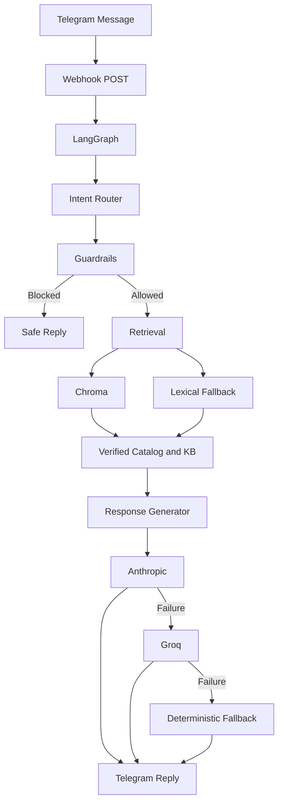

# Intelligent Ecom Agent

Telegram sales assistant for a fashion e-commerce store, built to demonstrate production-minded AI engineering with FastAPI, LangGraph, deterministic guardrails, and optional Chroma-backed RAG.

## What This Project Proves

This project is intentionally not just a chatbot demo.

It is designed to show:

- agent orchestration with `LangGraph`
- separation between LLM-generated language and source-of-truth business data
- deterministic business guardrails
- real Telegram webhook integration
- a read-only web catalog API for product page rendering
- regression tests that protect critical store behavior

## Problem Statement

Most retail chatbots fail in the same place: they sound fluent, but they invent prices, sizes, stock, and policies.

This project is built around the opposite approach:

- the LLM is used for language generation
- catalog and inventory facts come from verified local data
- policy answers come from verified knowledge sources
- unsafe or irrelevant requests are blocked before generation

That design is the core business value of the system.

## Architecture

### Main components

- `FastAPI` receives Telegram webhook events
- `FastAPI` also exposes read-only catalog endpoints for the website layer
- `LangGraph` orchestrates the intent, retrieval, guardrails, response, and fallback flow
- `JSON catalog` acts as the deterministic product source of truth
- `Markdown knowledge base` stores policies, FAQ, and size guidance
- `Chroma` can back semantic retrieval through local persistence
- `Anthropic` is the primary text generation provider
- `Groq` is the fallback generation provider
- `OpenAI Embeddings` is used only for vector indexing and similarity search

### Flow Diagram



## Why These Decisions Were Made

### 1. LangGraph instead of a single prompt chain

- Decision: model the assistant as explicit nodes for intent, retrieval, guardrails, response, and fallback
- Why: the project goal is not just text generation; it is controllable agent behavior with inspectable transitions
- Business impact: easier debugging, safer extensions, clearer interview story

### 2. Deterministic catalog data instead of asking the LLM for inventory facts

- Decision: price, color, size, and stock come from the catalog and inventory logic, not from generated text
- Why: these are the highest-risk hallucination fields in e-commerce
- Business impact: prevents false availability claims and wrong pricing answers

### 3. Guardrails before generation

- Decision: block prompt injection and out-of-scope requests before retrieval and generation
- Why: a blocked request is safer and cheaper than a generated wrong answer
- Business impact: protects the assistant from jailbreak-style misuse and keeps the bot on brand

### 4. Chroma as optional local persistence with lexical fallback

- Decision: keep retrieval compatible with local embedded Chroma, but allow the app to continue working when the vector store has not been indexed yet
- Why: this reduces demo fragility during early phases while preserving the target RAG architecture
- Business impact: the bot remains usable while retrieval infrastructure is still being finalized

### 5. Anthropic primary with Groq fallback

- Decision: use provider fallback for final response generation
- Why: production systems need graceful degradation, not total failure on one provider outage
- Business impact: better uptime and a stronger reliability story

### 6. OpenAI only for embeddings, not for response generation

- Decision: use `OpenAIEmbeddings` only in the retrieval layer
- Why: the current project uses Anthropic and Groq for response generation, but embeddings are a separate capability and this implementation uses OpenAI exclusively for vectorization
- Business impact: keeps the response path resilient across two generation providers while using a pragmatic, well-supported embedding layer for RAG

### 7. Read-only catalog API for Lovable and product pages

- Decision: expose `GET /api/catalog` and `GET /api/catalog/{product_id}` from the same FastAPI app
- Why: the website should consume the exact same catalog source of truth as the agent, without duplicating data or exposing internal agent mechanics
- Business impact: keeps Telegram replies, product pages, and future storefront UI aligned on the same verified catalog data

For the full historical decision log, see [ADR.md](/home/rodezayas/LangGraph-Ecom-Assistant/ADR.md).

## Business Rules

These are the rules the assistant is built around.

### Catalog truth rules

- The assistant only answers with verified Nova Style catalog data.
- The assistant must not invent products that do not exist in the catalog.
- Price, size, color, and stock must come from deterministic data, never from the LLM.
- The website layer must consume the same catalog source of truth as the agent.

### Policy truth rules

- Shipping, returns, payment, FAQ, and size guidance must come from verified knowledge-base documents.
- If the verified documents do not support a claim, the assistant must not make that claim.

### Safety and scope rules

- Prompt injection attempts must be blocked.
- Out-of-domain requests must be rejected honestly.
- The assistant must not claim discounts, shipping promises, or exceptions not present in the source of truth.

### Reliability rules

- If the primary LLM provider fails, the fallback provider should be used.
- If both providers fail, the system must still return a deterministic safe response.

### API exposure rules

- Public web access is limited to read-only catalog endpoints.
- Guardrails, LangGraph internals, and RAG internals must not be exposed as public website endpoints.

## Tests That Protect Business Rules

This project includes tests that target business behavior, not only implementation details.

### Guardrails

- [tests/test_guardrails.py](/home/rodezayas/LangGraph-Ecom-Assistant/tests/test_guardrails.py)
- Protects against:
  prompt injection bypass attempts
  out-of-scope domain drift
  false blocking of valid product or policy queries

### Chatbot behavior

- [tests/test_chatbot.py](/home/rodezayas/LangGraph-Ecom-Assistant/tests/test_chatbot.py)
- Protects against:
  failure to return a verified catalog match
  dishonest fallback behavior
  prompt injection leaking through the graph
  policy questions failing to return verified knowledge

### LLM provider fallback

- [tests/test_llm_fallback.py](/home/rodezayas/LangGraph-Ecom-Assistant/tests/test_llm_fallback.py)
- Protects against:
  provider outage causing total response failure
  incorrect fallback order

### Telegram webhook behavior

- [tests/test_telegram_webhook.py](/home/rodezayas/LangGraph-Ecom-Assistant/tests/test_telegram_webhook.py)
- Protects against:
  broken reply delivery flow
  bad handling of empty Telegram messages
  failures while sending replies back to Telegram

### Catalog API behavior

- [tests/test_catalog_api.py](/home/rodezayas/LangGraph-Ecom-Assistant/tests/test_catalog_api.py)
- Protects against:
  wrong product payload shape
  missing-product requests returning an ambiguous response
  write attempts against read-only catalog routes
  browser CORS failures for Lovable origins

### Data and retrieval integrity

- [tests/test_catalog.py](/home/rodezayas/LangGraph-Ecom-Assistant/tests/test_catalog.py)
- [tests/test_rag_documents.py](/home/rodezayas/LangGraph-Ecom-Assistant/tests/test_rag_documents.py)
- [tests/test_vectorstore_indexing.py](/home/rodezayas/LangGraph-Ecom-Assistant/tests/test_vectorstore_indexing.py)
- Protect against:
  missing variants in catalog data
  malformed RAG documents
  broken Chroma indexing and retrieval behavior

## Current Status

- Telegram webhook flow has already been validated end to end with a real bot and `ngrok`.
- The app currently works even without `data/vectorstore` because retrieval falls back to lexical matching.
- Full embedding-backed retrieval remains pending until `uv run ecomm-agent index-rag` is executed.
- The app now exposes read-only catalog endpoints for a Lovable-hosted website or product page layer.
- The repo is prepared for deployment to Render from GitHub via `render.yaml`.

## Project Structure

```text
src/ecomm_agent/
  api/              FastAPI routes
  agents/           LangGraph state, nodes, graph wiring
  core/             configuration and shared domain concerns
  rag/              Chroma document building and indexing
  schemas/          Pydantic schemas
  services/         catalog, inventory, guardrails, Telegram, LLM, retrieval
  observability/    logging setup
data/
  catalog/          source-of-truth products
  knowledge/        policies, FAQ, size guide
tests/              business and integration protection
```

## Local Setup

### Required environment

```env
TELEGRAM_BOT_TOKEN=...
TELEGRAM_WEBHOOK_PUBLIC_URL=https://your-public-url
FRONTEND_BASE_URL=https://alta-norma-fashion.lovable.app
ANTHROPIC_API_KEY=...
ANTHROPIC_MODEL=claude-sonnet-4-20250514
GROQ_API_KEY=...
GROQ_MODEL=llama-3.3-70b-versatile
OPENAI_API_KEY=...
OPENAI_EMBEDDING_MODEL=text-embedding-3-small
VECTOR_STORE_PATH=./data/vectorstore
KNOWLEDGE_BASE_DIR=./data/knowledge
```

`TELEGRAM_WEBHOOK_PUBLIC_URL` must be the public base URL, not the full webhook path. On startup, the app registers `/webhook/telegram` automatically when both Telegram settings are present.

`OPENAI_API_KEY` and `OPENAI_EMBEDDING_MODEL` are only required for the embeddings layer. They are not used for final answer generation. The current generation path is `Anthropic -> Groq -> deterministic fallback`.

`FRONTEND_BASE_URL` is the public Lovable frontend base URL. When it is configured, product-search responses can include links like `https://alta-norma-fashion.lovable.app/products/TSH-001`.

### Run locally

```bash
uv sync --extra dev
uv run uvicorn ecomm_agent.main:app --reload
```

### Index the vector store

```bash
uv run ecomm-agent index-rag
```

Use this only when you want semantic retrieval through Chroma instead of lexical fallback.

### Run tests

```bash
uv run pytest
```

### Run lint

```bash
uv run ruff check src tests
```

## Render Deployment

This repo includes [render.yaml](/home/rodezayas/LangGraph-Ecom-Assistant/render.yaml) for GitHub-based deployment on Render.

### What Render will use

- runtime: Docker
- health check: `/health`
- public HTTPS base URL for:
  Telegram webhook delivery
  Lovable catalog fetches

### Required Render environment variables

Set these in Render before going live:

- `TELEGRAM_WEBHOOK_PUBLIC_URL`
  Use your final Render service URL, for example `https://your-service.onrender.com`
- `TELEGRAM_BOT_TOKEN`
- `ANTHROPIC_API_KEY`
- `GROQ_API_KEY`
- `OPENAI_API_KEY`

Already scaffolded in `render.yaml`:

- `ENVIRONMENT=production`
- `FRONTEND_BASE_URL=https://alta-norma-fashion.lovable.app`
- `OPENAI_EMBEDDING_MODEL=text-embedding-3-small`
- `ANTHROPIC_MODEL=claude-sonnet-4-20250514`
- `GROQ_MODEL=llama-3.3-70b-versatile`
- `VECTOR_STORE_PATH=/tmp/data/vectorstore`

### Production notes

- Render replaces `ngrok` as the public backend URL.
- Lovable should point `VITE_API_BASE_URL` to the final Render service URL.
- Telegram should point `TELEGRAM_WEBHOOK_PUBLIC_URL` to the same Render service URL.
- `VECTOR_STORE_PATH=/tmp/data/vectorstore` is ephemeral on Render. Until you move to durable vector storage, treat Chroma indexing there as rebuildable cache, not persistent infrastructure.
- The app still works without a persisted vector store because lexical fallback remains active.

## Demo Notes

- The webhook path is `POST /webhook/telegram`.
- The public read-only catalog endpoints are `GET /api/catalog` and `GET /api/catalog/{product_id}`.
- Telegram `chat.id` is used as the conversation thread identifier.
- The current implementation supports real Telegram reply delivery through `sendMessage`.
- For local public testing, `ngrok` works well as the webhook ingress layer.
- For stable hosting, use the Render deployment target in this repo instead of `ngrok`.

## Production Smoke Tests

Replace `https://your-service.onrender.com` with the real Render base URL.

### Health

```bash
curl https://your-service.onrender.com/health
```

Expected response:

```json
{"status":"ok"}
```

### Catalog detail

```bash
curl https://your-service.onrender.com/api/catalog/TSH-001
```

### Catalog list

```bash
curl https://your-service.onrender.com/api/catalog
```

### Chat webhook simulation

This tests the same webhook endpoint Telegram uses, without needing to send a real Telegram message.

```bash
curl -X POST https://your-service.onrender.com/webhook/telegram \
  -H 'content-type: application/json' \
  -d '{
    "update_id": 1,
    "message": {
      "message_id": 99,
      "chat": {"id": 12345},
      "text": "do you have black running shoes under 1500?"
    }
  }'
```

Expected behavior:

- the endpoint returns `202`
- the response includes `response_text`
- if `TELEGRAM_BOT_TOKEN` is configured correctly in production, the app will also attempt `sendMessage` back to that same `chat.id`

## Catalog API

The website layer should consume the same source-of-truth catalog used by the agent.

### Endpoints

`GET /api/catalog`

- Returns the full catalog as `list[Product]`
- Useful for category pages, listing views, or a future `/catalogo` page in Lovable

`GET /api/catalog/{product_id}`

- Returns one product as `Product`
- Returns `404` with a clear message if the product does not exist
- Best endpoint for a product detail page fed by an agent-shared URL

### Contract

- The response shape reuses the existing internal `Product` schema
- The data comes from the same `data/catalog/products.json` source already used by the agent
- These routes are read-only and only expose `GET`

### CORS

- The FastAPI app allows Lovable browser origins for catalog fetches
- This is required so the frontend can call the API directly from the browser

## Maintenance

See [MAINTENANCE.md](/home/rodezayas/LangGraph-Ecom-Assistant/MAINTENANCE.md) for operational notes, reindexing guidance, and deployment considerations.
